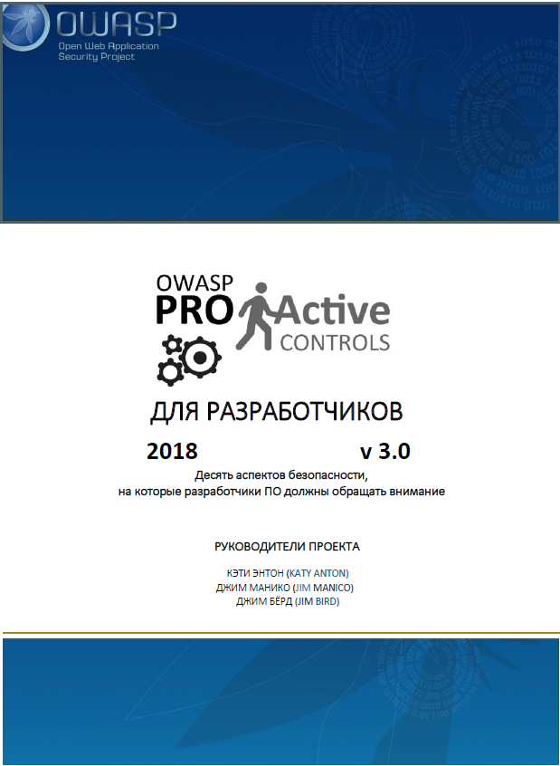
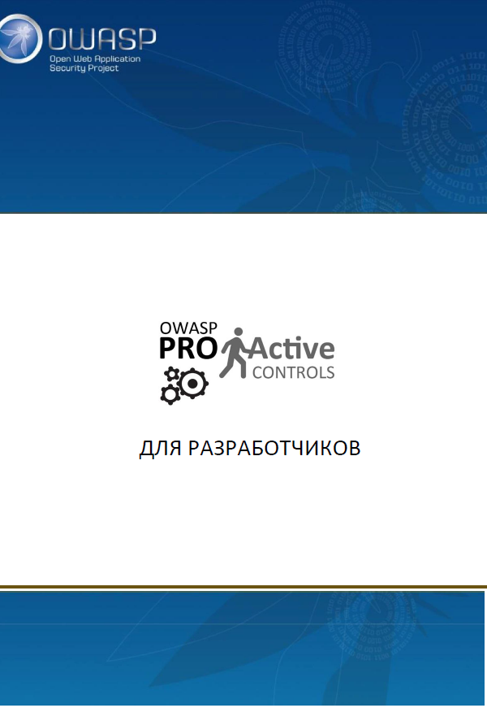

<!-- TOC depthTo:3 -->

- [Об OWASP](#об-owasp)
- [Предисловие](#предисловие)
    - [Цели и задачи](#цели-и-задачи)
    - [Призыв к действию](#призыв-к-действию)
    - [Авторские права и лицензирование](#авторские-права-и-лицензирование)
    - [Руководители проекта](#руководители-проекта)
    - [Участники проекта](#участники-проекта)
- [Структура документа](#структура-документа)
    - [Описание](#описание)
    - [Реализация](#реализация)
    - [Предотвращаемые уязвимости](#предотвращаемые-уязвимости)
    - [Ссылки](#ссылки)
    - [Инструменты](#инструменты)
- [Введение](#введение)
    - [Топ-10 рекомендаций по проактивной защите](#топ-10-рекомендаций-по-проактивной-защите)
    - [Как создавался список рекомендаций](#как-создавался-список-рекомендаций)
    - [Целевая аудитория](#целевая-аудитория)
    - [Как пользоваться документом](#как-пользоваться-документом)
    - [Связь с проектом Топ-10 OWASP](#связь-с-проектом-топ-10-owasp)
- [C1: Определение требований безопасности](#c1-определение-требований-безопасности)
    - [Описание](#описание-1)
        - [OWASP ASVS](#owasp-asvs)
        - [Дополнение требований на основе сценариев эксплуатации и случаев неправомерного использования](#дополнение-требований-на-основе-сценариев-эксплуатации-и-случаев-неправомерного-использования)
    - [Реализация](#реализация-1)
        - [Поиск и выбор](#поиск-и-выбор)
        - [Исследование и документирование](#исследование-и-документирование)
        - [Реализация и тестирование](#реализация-и-тестирование)
    - [Предотвращаемые уязвимости](#предотвращаемые-уязвимости-1)
    - [Ссылки](#ссылки-1)
- [C2: Использование безопасных фреймворков и библиотек](#c2-использование-безопасных-фреймворков-и-библиотек)
    - [Описание](#описание-2)
    - [Рекомендации по реализации](#рекомендации-по-реализации)
    - [Предотвращаемые уязвимости](#предотвращаемые-уязвимости-2)
    - [Инструменты](#инструменты-1)
- [C3: Обеспечение безопасного доступа к базам данных](#c3-обеспечение-безопасного-доступа-к-базам-данных)
    - [Описание](#описание-3)
    - [Безопасность запросов](#безопасность-запросов)
        - [Примечание о параметризации запросов](#примечание-о-параметризации-запросов)
    - [Безопасность конфигурации](#безопасность-конфигурации)
    - [Безопасность аутентификации](#безопасность-аутентификации)
    - [Безопасность соединений](#безопасность-соединений)
    - [Предотвращаемые уязвимости](#предотвращаемые-уязвимости-3)
    - [Ссылки](#ссылки-2)
- [C4: Кодирование и экранирование данных](#c4-кодирование-и-экранирование-данных)
    - [Описание](#описание-4)
    - [Контекстуальное кодирование выходных данных](#контекстуальное-кодирование-выходных-данных)
        - [Примеры кодирования Java](#примеры-кодирования-java)
        - [Примеры кодирования .NET](#примеры-кодирования-net)
        - [Примеры кодирования PHP](#примеры-кодирования-php)
    - [Другие способы кодирования и защиты от внедрений](#другие-способы-кодирования-и-защиты-от-внедрений)
        - [Нормализация и кодировка символов](#нормализация-и-кодировка-символов)
    - [Предотвращаемые уязвимости](#предотвращаемые-уязвимости-4)
    - [Ссылки](#ссылки-3)
    - [Инструменты](#инструменты-2)
- [C5: Обязательная проверка всех входных данных](#c5-обязательная-проверка-всех-входных-данных)
    - [Описание](#описание-5)
    - [Синтаксическая и семантическая норма](#синтаксическая-и-семантическая-норма)
    - [Белые и черные списки](#белые-и-черные-списки)
    - [Проверки на стороне клиента и на стороне сервера](#проверки-на-стороне-клиента-и-на-стороне-сервера)
    - [Регулярные выражения](#регулярные-выражения)
        - [Внимание! Возможен отказ в обслуживании](#внимание-возможен-отказ-в-обслуживании)
        - [Внимание! Сложность реализации](#внимание-сложность-реализации)
    - [Ограничения проверок входных данных](#ограничения-проверок-входных-данных)
    - [Проблемы проверки сериализованных данных](#проблемы-проверки-сериализованных-данных)
    - [Непредусмотренные входные данные (массовое назначение)](#непредусмотренные-входные-данные-массовое-назначение)
    - [Проверка и очистка HTML](#проверка-и-очистка-html)
    - [Функции проверки в библиотеках и фреймворках](#функции-проверки-в-библиотеках-и-фреймворках)
    - [Предотвращаемые уязвимости](#предотвращаемые-уязвимости-5)
    - [Ссылки](#ссылки-4)
    - [Инструменты](#инструменты-3)
- [C6: Внедрение цифровых идентификаторов](#c6-внедрение-цифровых-идентификаторов)
    - [Описание](#описание-6)
    - [Уровни аутентификации](#уровни-аутентификации)
        - [Уровень 1: Пароли](#уровень-1-пароли)
        - [Уровень 2: Многофакторная аутентификация (МФА)](#уровень-2-многофакторная-аутентификация-мфа)
        - [Уровень 3: Аутентификация на основе шифрования](#уровень-3-аутентификация-на-основе-шифрования)
    - [Управление сессиями](#управление-сессиями)
        - [Создание и завершение сессий](#создание-и-завершение-сессий)
        - [Куки-файлы браузеров](#куки-файлы-браузеров)
        - [Токены](#токены)
        - [JWT (веб-токены JSON)](#jwt-веб-токены-json)
    - [Внимание!](#внимание)
    - [Предотвращаемые уязвимости](#предотвращаемые-уязвимости-6)
    - [Ссылки](#ссылки-5)
    - [Инструменты](#инструменты-4)
- [C7: Обязательный контроль доступа](#c7-обязательный-контроль-доступа)
    - [Описание](#описание-7)
    - [Принципы создания систем контроля доступа](#принципы-создания-систем-контроля-доступа)
        - [1) Проектируйте тщательно и заранее](#1-проектируйте-тщательно-и-заранее)
        - [2) Направляйте все запросы через систему контроля доступа](#2-направляйте-все-запросы-через-систему-контроля-доступа)
        - [3) Запрещайте доступ по умолчанию](#3-запрещайте-доступ-по-умолчанию)
        - [4) Принцип минимальных привилегий](#4-принцип-минимальных-привилегий)
        - [5) Не используйте жестко закодированные роли](#5-не-используйте-жестко-закодированные-роли)
        - [6) Регистрируйте все события, связанные с контролем доступа](#6-регистрируйте-все-события-связанные-с-контролем-доступа)
    - [Предотвращаемые уязвимости](#предотвращаемые-уязвимости-7)
    - [Ссылки](#ссылки-6)
    - [Инструменты](#инструменты-5)
- [C8: Повсеместная защита данных](#c8-повсеместная-защита-данных)
    - [Описание](#описание-8)
    - [Классификация данных](#классификация-данных)
    - [Шифрование передаваемых данных](#шифрование-передаваемых-данных)
    - [Шифрование хранимых данных](#шифрование-хранимых-данных)
        - [Мобильные приложения: Безопасное локальное хранение данных](#мобильные-приложения-безопасное-локальное-хранение-данных)
        - [Жизненный цикл ключей](#жизненный-цикл-ключей)
        - [Управление секретами в приложении](#управление-секретами-в-приложении)
    - [Предотвращаемые уязвимости](#предотвращаемые-уязвимости-8)
    - [Ссылки](#ссылки-7)
    - [Инструменты](#инструменты-6)
- [C9: Внедрение журналирования и мониторинга событий безопасности](#c9-внедрение-журналирования-и-мониторинга-событий-безопасности)
    - [Описание](#описание-9)
    - [Польза от журналирования событий безопасности](#польза-от-журналирования-событий-безопасности)
    - [Реализация журналирования событий безопасности](#реализация-журналирования-событий-безопасности)
        - [Журналирование с целью обнаружения атак и противодействия им](#журналирование-с-целью-обнаружения-атак-и-противодействия-им)
    - [Разработка системы журналирования событий безопасности](#разработка-системы-журналирования-событий-безопасности)
    - [Ссылки](#ссылки-8)
    - [Инструменты](#инструменты-7)
- [C10: Обязательная обработка всех ошибок и исключений](#c10-обязательная-обработка-всех-ошибок-и-исключений)
    - [Описание](#описание-10)
    - [Некорректная обработка ошибок](#некорректная-обработка-ошибок)
    - [Полезные советы](#полезные-советы)
    - [Ссылки](#ссылки-9)
    - [Инструменты](#инструменты-8)
- [Заключение](#заключение)

<!-- /TOC -->
# Об OWASP

_"Открытый проект по обеспечению безопасности веб-приложений (OWASP)"_ представляет собой некоммерческий (501c3), образовательный, благотворительный фонд, помогающей организациям начать проектировать, разрабатывать, приобретать, использовать и поддерживать безопасное ПО. Все инструменты, документы, форумы и отделения OWASP являются бесплатными и открытыми для тех, кто заинтересован в улучшении безопасности приложений. Информацию о нас можно найти по адресу www.owasp.org.

OWASP представляет собой новый тип организации. Наша независимость от коммерческого влияния позволяет нам предоставлять беспристрастные, практические и эффективные данные по безопасности приложений.

OWASP не связан ни с одной технологической компанией. Как и большинство проектов, занимающихся программным обеспечением с открытым кодом, OWASP выпускает множество различных материалов, действуя прозрачно и открыто для других участников проекта. Фонд OWASP является некоммерческой организацией, что обеспечивает проекту долгосрочный успех.

# Предисловие

Ненадежное программное обеспечение подрывает безопасность критических инфраструктур, относящихся, например, к здравоохранению, обороне, энергетике или финансам. Наша цифровая, глобальная инфраструктура становится сложнее, взаимосвязей между ее компонентами становится все больше, поэтому важность обеспечения безопасности приложений возрастает экспоненциально. Больше нельзя оставлять без должного внимания относительно простые угрозы безопасности.

## Цели и задачи

Целью проекта "Топ-10 OWASP: Проактивная защита" является привлечение внимания к безопасности приложений, путем рассмотрения наиболее важных аспектов безопасности, на которые разработчикам ПО стоит обращать внимание. Мы призываем организации воспользоваться рекомендациями OWASP по проактивной защите и научить разработчиков обращать внимание на безопасность приложений, принимая во внимание ошибки, имевшие место в других организациях. Надеемся, что рекомендации OWASP окажутся полезными при создании вами безопасных приложений.

## Призыв к действию

Все вопросы, комментарии и идеи вы можете отправлять в общий список рассылки или на адрес электронной почты jim@owasp.org.

## Авторские права и лицензирование

Данный документ выпущен под лицензией Creative Commons Attribution ShareAlike 3.0. В случае переиспользования или распространения данного документа необходимо указывать условия лицензионного соглашения, действующие в его отношении.

## Руководители проекта

* __Кэйти Энтон__ (Katy Anton)
* __Джим Бёрд__ (Jim Bird)
* __Джим Манико__ (Jim Manico)

## Участники проекта

* __Крис Ромио__ (Chris Romeo)
* __Ден Андерсон__ (Dan Anderson)
* __Дэвид Сайбак__ (David Cybuck)
* __Дейв Фергюсон__ (Dave Ferguson)
* __Джош Гроссман__ (Josh Grossman)
* __Осама Эльнаггар__ (Osama Elnaggar)
* __Колин Уотсон__ (Colin Watson)
* __Рик Митчелл__ (Rick Mitchell)
* И многие другие…

# Структура документа

Данный документ представлен в виде списка требований к безопасности. Каждое требование описывается следующим образом:

## Описание

Подробное описание требования, включая некоторые рекомендации.

## Реализация

Рекомендации по реализации и примеры, иллюстрирующие способы реализации каждого требования.

## Предотвращаемые уязвимости

Список предотвращаемых уязвимостей или угроз (например, Топ-10 угроз OWASP или CWE).

## Ссылки

Перечень справочных источников для дальнейшего изучения (например, памятки OWASP или руководства по улучшению безопасности).

## Инструменты

Перечень инструментов или проектов, позволяющих реализовать или интегрировать требования безопасности в ПО.

# Введение

"Проактивная защита OWASP: Топ-10 рекомендаций 2018" представляет собой перечень методик по обеспечению безопасности и рекомендуется к использованию во всех проектах разработки ПО. Этот документ написан для разработчиков, еще не знакомых с безопасным программированием.

Одной из основных целей данного документа является создание практического руководства, позволяющего разработчикам создавать безопасное программное обеспечение. Приводимые в документе техники необходимо применять проактивно, на ранних стадиях разработки, для достижения максимальной эффективности.

## Топ-10 рекомендаций по проактивной защите

Рекомендации в списке располагаются по степени их важности, в первом пункте указана самая важная из них:
* __C1__: [Определение требований безопасности](c1.md)
* __C2__: [Использование безопасных фреймворков и библиотек](c2.md)
* __C3__: [Обеспечение безопасного доступа к базам данных](c3.md)
* __C4__: [Кодирование и экранирование данных](c4.md)
* __C5__: [Обязательная проверка всех входных данных](c5.md)
* __C6__: [Внедрение цифровых идентификаторов](c6.md)
* __C7__: [Обязательный контроль доступа](c7.md)
* __C8__: [Повсеместная защита данных](c8.md)
* __C9__: [Внедрение журналирования и мониторинга событий безопасности](c9.md)
* __C10__: [Обязательная обработка всех ошибок и исключений](c10.md)

## Как создавался список рекомендаций

Изначально данный список был составлен текущими руководителями проекта с участием нескольких добровольцев. Затем документ был опубликован в открытом доступе, чтобы даже анонимные пользователи могли вносить свои предложения. Сотни изменений были приняты на основе предложений, поступивших от сообщества.

## Целевая аудитория

Документ предназначается прежде всего разработчикам. Однако, руководители разработки, менеджеры продуктов, специалисты по обеспечению качества, руководители проектов, а также остальные участники процесса создания программного обеспечения могут почерпнуть полезную информацию из данного документа.

## Как пользоваться документом

Документ предназначен для ознакомления с основами разработки безопасного программного обеспечения, а также содержит хорошую подборку материалов, позволяющую создавать вводные курсы по безопасности ПО для разработчиков. Приведенные в документе рекомендации необходимо выполнять последовательно и в полной мере для всех без исключения приложений. Тем не менее, данный документ стоит рассматривать скорее как отправную точку, а не как исчерпывающий набор методов и практик. Полноценный процесс безопасной разработки должен включать в себя разносторонние требования из стандартов, подобных "Стандарту подтверждения безопасности приложений OWASP (ASVS)", а также предусматривать мероприятия по разработке ПО, описанные в моделях зрелости, таких как [OWASP SAMM (Модель обеспечения безопасности ПО)](https://www.owasp.org/index.php/OWASP_SAMM_Project) и [BSIMM (Сводная модель обеспечения безопасности ПО)](https://www.bsimm.com/).

## Связь с проектом Топ-10 OWASP

Проект **"Топ-10 OWASP: Проактивная защита"** аналогичен проекту **"Топ-10 OWASP"**, но акцент делается на методах и рекомендациях по защите от угроз, а не на самих угрозах. Каждый метод и рекомендация в данном документе связаны с одной или несколькими угрозами из списка Топ-10 OWASP. Информация о связях приводится в конце описания каждого требования.

# C1: Определение требований безопасности

## Описание

Требования безопасности описывают функции, которые необходимо реализовать для обеспечения определенных параметров безопасности ПО. Требования безопасности составляются на основе промышленных стандартов, действующих законов и данных об обнаруженных уязвимостях. Требования безопасности определяют функции, которые необходимо разработать или доработать для решения определенных проблем с безопасностью или устранения потенциальных угроз.

Требования безопасности содержат проверенные методы обеспечения безопасности приложений. Вместо создания собственных решений для каждого приложения, разработчики могут воспользоваться стандартными требованиями с описанными в них настройками безопасности и рекомендациями. Эти методы основаны на решениях проблем с безопасностью, имевших место в прошлом. Требования нацелены на предотвращение повторного возникновения аналогичных проблем с безопасностью.

### OWASP ASVS

[Стандарт подтверждения безопасности приложений OWASP (ASVS)](https://www.owasp.org/index.php/Category:OWASP_Application_Security_Verification_Standard_Project) представляет собой каталог доступных требований безопасности и параметров проверки. OWASP ASVS может служить источником расширенных требований безопасности для команд разработчиков.

Требования безопасности объединены в категории на основе общих функций безопасности высшего порядка. Например, ASVS содержит следующие категории: аутентификация, контроль доступа, обработка и журналирование ошибок, а также веб-службы. Каждая категория содержит перечень требований, представляющих собой рекомендации для данной категории в виде списка проверяемых параметров.

### Дополнение требований на основе сценариев эксплуатации и случаев неправомерного использования

Требования ASVS описывают основные параметры проверок, которые могут быть расширены на основе сценариев эксплуатации заказчика или случаев неправомерного использования приложения. Преимущество данного подхода заключается в том, что он позволяет связать реальные сценарии использования приложения заказчиком или злоумышленником с тем, что система предлагает пользователю.

Ниже представлен пример расширения требования ASVS 3.0.1. Пункт 2.19 раздела "Требования проверки аутентификации" ASVS 3.0.1 посвящен паролям по умолчанию:

* 2.19 Удостоверьтесь в том, что пароли, задаваемые по умолчанию (например, "admin/password"), не используются для фреймворка приложения или в каком-либо из компонентов приложения.

Данное требование описывает проверку на отсутствия паролей по умолчанию и запрет на использование паролей по умолчанию в приложении.

Сценарий эксплуатации предполагает наличие пользователя, администратора или злоумышленника, а также описывает функциональные возможности системы на основе ожиданий пользователя. Сценарий эксплуатации заказчика представляется в следующей форме: _"В качестве пользователя я могу выполнить x, y и z"_.

```
В качестве пользователя, для получения доступа к приложению, я могу ввести имя пользователя и пароль.
В качестве пользователя я могу ввести длинный пароль, не превышающий 1023 символов.
```
Сценарии, описывающие злоумышленников и их действия, называются случаями неправомерного использования.

```
В качестве злоумышленника, для получения доступа, я могу ввести имя пользователя и пароль, задаваемые по умолчанию.
```
Данный сценарий похож на традиционное требование ASVS, но содержит дополнительную информацию о пользователе или злоумышленнике, облегчающую проверку реализации требования.

## Реализация

Процесс успешного применения требований безопасности включает в себя четыре этапа: поиск и выбор, документирование, реализация, подтверждение правильности реализации новых функций безопасности и функциональности приложения.

### Поиск и выбор

Процесс начинается с поиска и отбора требований безопасности. На этом этапе разработчик изучает информацию, представленную в стандартных источниках, например, ASVS, и выбирает требования, которые будут включены в одну из версий приложения. Цель данного этапа заключается в выборе реализуемого количества требований безопасности, которые могут быть добавлены в рамках отдельного релиза или спринта. Для каждого последующего спринта процесс повторяется, и все больше функций безопасности внедряется в приложение.

### Исследование и документирование

На этапе исследования и документирования разработчик проверяет приложение на соответствие новому набору требований безопасности, а в случае несоответствия определяет объем необходимых доработок. Исследование завершается документированием результатов проверки.

### Реализация и тестирование

После определения объема доработок, разработчику необходимо модифицировать приложение для добавления новых или удаления небезопасных функций. На этом этапе разработчик сначала создает проект выполнения требования, а затем вносит изменения в код для его реализации. Для подтверждения наличия новой функции или отсутствия присутствовавшего ранее небезопасного параметра необходимо провести тестирование.

## Предотвращаемые уязвимости

Требования безопасности определяют безопасность приложения. Функции обеспечения безопасности, реализуемые в приложении с самого начала его жизненного цикла, помогут предотвратить большое количество различных уязвимостей.

## Ссылки

* [Стандарт подтверждения безопасности приложений OWASP (ASVS)](https://www.owasp.org/index.php/Application_Security_Architecture_Cheat_Sheet)
* [Стандарт подтверждения безопасности мобильных приложений OWASP (MASVS)](https://github.com/OWASP/owasp-masvs)
* [Топ-10 OWASP](https://www.owasp.org/index.php/Category:OWASP_Top_Ten_Project)

# C2: Использование безопасных фреймворков и библиотек

## Описание

Безопасные библиотеки и фреймворки со встроенными функциями безопасности помогают разработчикам избежать появления уязвимостей на этапе разработки и реализации. Разработчики, создающие приложение с нуля, могут не иметь достаточных знаний, времени или средств для реализации или поддержания безопасности приложения. Использование безопасных фреймворков позволяет добиваться безопасности приложений более эффективно.

## Рекомендации по реализации

При включении сторонних библиотек или фреймворков в свое ПО необходимо учитывать следующие рекомендации:

1. Используйте библиотеки и фреймворки из доверенных источников, которые активно разрабатываются и широко применяются в приложениях.
2.	Составьте и поддерживайте в актуальном состоянии каталог всех сторонних библиотек. 
3.	Своевременно обновляйте библиотеки и компоненты. Используйте инструменты, такие как [Проверки зависимостей OWASP](https://www.owasp.org/index.php/OWASP_Dependency_Check) и [Retire.JS](https://retirejs.github.io/retire.js/), для определения зависимостей в проектах, а также проверяйте наличие известных и опубликованных уязвимостей в стороннем коде.
4.	Для снижения вероятности атак используйте инкапсуляцию библиотек и только необходимый для вашего ПО функционал.

## Предотвращаемые уязвимости

Использование безопасных фреймворков и библиотек поможет избежать большого количество уязвимостей в веб-приложениях. Очень важно поддерживать эти фреймворки и библиотеки в актуальном состоянии (см. раздел об [использовании компонентов с известными уязвимостями в Топ-10 2017 года](https://www.owasp.org/index.php/Category:OWASP_Top_Ten_Project)).

## Инструменты

* [Проверки зависимостей OWASP](https://www.owasp.org/index.php/OWASP_Dependency_Check) — определяют зависимости в проектах и проверяют наличие общеизвестных уязвимостей.
* [Retire.JS](http://retirejs.github.io/retire.js/) — сканер библиотек JavaScript.

# C3: Обеспечение безопасного доступа к базам данных

## Описание

Данный раздел посвящен обеспечению безопасного доступа ко всем хранилищам данных, включая реляционные базы данных и базы данных NoSQL. Рассматриваются следующие вопросы:

* Безопасность запросов
* Безопасность конфигурации
* Безопасность аутентификации
* Безопасность соединений

## Безопасность запросов

SQL-код может быть внедрен, если непроверенные входные данные динамически добавляются в SQL-запросы, обычно путем присоединения к основной строке. Внедрение SQL-кода представляет одну из наиболее серьезных угроз безопасности приложения. Внедрение SQL-кода легко осуществить; эксплуатация данной уязвимости может привести к краже, удалению или изменению баз данных. Приложение также может быть использовано для выполнения вредоносных команд в системе, содержащей вашу базу данных, таким образом позволяя злоумышленнику закрепиться в сети.

Для предотвращения SQL-внедрений необходимо избегать интерпретации непроверенных входных данных в составе SQL-команд. Наилучшим решением будет использование метода "параметризации запросов". Этот метод необходимо применять к конструкциям SQL и OQL, а также хранимым процедурам.

Примеры параметризации запросов для ASP, ColdFusion, C#, Delphi, .NET, Go, Java, Perl, PHP, PL/SQL, PostgreSQL, Python, R, Ruby и Scheme можно найти на сайте http://bobby-tables.com и в [памятке OWASP по параметризации запросов](https://www.owasp.org/index.php/Query_Parameterization_Cheat_Sheet).

### Примечание о параметризации запросов

Некоторые области запросов к базам данных (БД) нельзя параметризировать. Эти области отличаются в зависимости от вендора БД. Внимательно выполняйте проверку точных совпадений или ручную очистку при работе с параметрами запросов к БД, которые не могут быть привязаны к параметризованному запросу. Использование параметризованных запросов обычно положительно сказывается на производительности, однако некоторые запросы в определенных реализациях баз данных могут оказать негативное воздействие на производительность. Обязательно тестируйте влияние запросов на производительность, особенно комплексных запросов с поддержкой развернутых выражений LIKE или текстового поиска.

## Безопасность конфигурации

К сожалению, системы управления базами данных (СУБД) не всегда имеют безопасную конфигурацию по умолчанию. Необходимо убедиться в том, что имеющиеся средства обеспечения безопасности СУБД и платформы, на которой она установлена, используются и настроены корректно. Для большинства распространенных СУБД доступны стандарты, руководства и тесты производительности.

## Безопасность аутентификации

Любой доступ к базам данных необходимо контролировать должным образом. Аутентификация доступа к СУБД должна выполняться безопасно и только по защищенному каналу. Также необходимо обеспечить безопасность и доступность учетных данных.

## Безопасность соединений

Большинство СУБД поддерживают несколько способов связи (например, через службы или API), которые могут быть безопасными (аутентифицированными, зашифрованными) и небезопасными (неаутентифицированными или незашифрованными). Рекомендуется использовать только безопасные методы связи, как это описано в разделе _"Повсеместная защита данных"_.

## Предотвращаемые уязвимости

* [Топ-10 OWASP 2017 - A1: Внедрение](https://www.owasp.org/index.php/Top_10-2017_A1-Injection)
* [Топ-10 OWASP 2014 (мобильные устройства) - M1: Ненадежные настройки на стороне сервера](https://www.owasp.org/index.php/Mobile_Top_10_2014-M1)

## Ссылки

* [Памятка OWASP: Параметризация запросов](https://www.owasp.org/index.php/Query_Parameterization_Cheat_Sheet)
* [Bobby Tables: Руководство по предотвращению внедрений SQL-кода](http://bobby-tables.com/)
* [Стандарты CIS по улучшению безопасности баз данных](https://www.cisecurity.org/cis-benchmarks/)

# C4: Кодирование и экранирование данных

## Описание

Кодирование и экранирование являются методами защиты от внедрения кода. __Кодирование__ (обычно называемое "кодированием выходных данных") представляет собой преобразование специальных символов в эквивалентные, не опасные для интерпретатора комбинации, например, преобразование символа "__<__" в сочетание "__\&lt;__" при его добавлении на __HTML-страницу__. __Экранирование__ заключается в добавлении спецсимволов перед символами или строками для предотвращения их некорректной интерпретации, например, добавление символа \ перед двойными кавычками (") позволяет интерпретировать их в качестве части текста, а не в качестве обозначения окончания строки.

Кодирование лучше всего применять __непосредственно перед__ передачей данных интерпретатору. Если применить данный метод на слишком раннем этапе обработки запроса, то кодирование или экранирование может сказаться на использование контента в других частях программы. Например, если при перед сохранением в базе данных HTML-контент экранируется, а интерфейс автоматически экранирует эти данные еще раз, то содержимое не будет отображаться корректно из-за двойного экранирования.

## Контекстуальное кодирование выходных данных

Контекстуальное кодирование выходных данных является ключевым для безопасного программирования и предотвращения межсайтового выполнения сценариев. Подобная мера защиты применяется при создании интерфейсов пользователя, непосредственно перед динамическим добавлением непроверенных данных к HTML-коду. Тип кодирования будет зависеть от места (или контекста) отображения или хранения данных в документе. Типы кодирования, рекомендуемые к использованию при создании безопасного интерфейса: кодирование сущностей или атрибутов HTML, а также кодирование JavaScript и URL.

### Примеры кодирования Java

Примеры использования кодировщика Java, обеспечивающего контекстуальное кодирование выходных данных, можно посмотреть на сайте [проекта кодировщика Java от OWASP](https://www.owasp.org/index.php/OWASP_Java_Encoder_Project#tab=Use_the_Java_Encoder_Project).

### Примеры кодирования .NET

Начиная с .NET 4.5, библиотека антимежсайтового выполнения сценариев является частью фреймворка, но не используется по умолчанию. Вы можете назначить AntiXssEncoder из этой библиотеки в качестве стандартного кодировщика вашего приложения, изменив настройки web.conf. При кодировании выходных данных необходимо учитывать контекст, т. е. использовать соответствующую функцию из библиотеки AntiXSSEncoder в зависимости от расположения данных в документе.

### Примеры кодирования PHP

**Zend Framework 2**

В Zend Framework 2 (ZF2) для кодирования выходных данных может быть использован Zend\Escaper. Примеры контекстного кодирования можно посмотреть на странице, посвященной [контекстному экранированию с помощью zend-escaper](https://framework.zend.com/blog/2017-05-16-zend-escaper.html).

## Другие способы кодирования и защиты от внедрений

Кодирование или экранирование может быть использовано для предотвращения других форм внедрений в контент. Например, можно нейтрализовывать некоторые специальные метасимволы при вводе данных для системных команд. Это называют "экранированием команд ОС", "экранированием shell" и т. п. Подобная защита может быть использована для предотвращения "Внедрения команд".

Существуют и другие формы экранирования, которые могут быть использованы для предотвращения внедрений, например, экранирование атрибутов XML, защищающее от различных форм внедрений XML и XML-путей, а также экранирование уникальных имен LDAP, позволяющее предотвратить различные LDAP-внедрения.

### Нормализация и кодировка символов

Кодировка Юникод — это способ хранения символов с использованием нескольких байтов. При вводе данных злоумышленник может использовать [Юникод](https://www.owasp.org/index.php/Unicode_Encoding), чтобы скрыть вредоносный код и получить возможность проведения различных атак. [RFC 2279](https://tools.ietf.org/html/rfc2279) описывает несколько способов кодировки текста.

Нормализация — это способ преобразования данных в простую или стандартную форму. В веб-приложениях нормализацию обычно используют для обеспечения единообразия символов всего контента при его хранении или отображении.

Защищенность от атак, связанных с нормализацией, означает отсутствие угроз безопасности приложения при вводе злоумышленником некорректно сформированных символов Юникода или любых других специально сформированных символов.

## Предотвращаемые уязвимости

* [Топ-10 OWASP 2017 - A1: Внедрение](https://www.owasp.org/index.php/Top_10-2017_A1-Injection)
* [Топ-10 OWASP 2017 - А7: Межсайтовое выполнение сценариев](https://www.owasp.org/index.php/Top_10-2017_A7-Cross-Site_Scripting_(XSS))
* [Топ-10 OWASP 2014 (мобильные устройства) - M7: Внедрение на стороне клиента](https://www.owasp.org/index.php/Mobile_Top_10_2014-M7)

## Ссылки

* [Межсайтовое выполнение сценариев](https://www.owasp.org/index.php/XSS) — общие сведения
* [Памятка OWASP: Предотвращение межсайтового выполнения сценариев](https://www.owasp.org/index.php/XSS_(Cross_Site_Scripting)_Prevention_Cheat_Sheet) — предотвращение XSS в веб-приложениях
* [Памятка OWASP: Предотвращение межсайтового выполнения сценариев на основе объектной модели документа](https://www.owasp.org/index.php/DOM_based_XSS_Prevention_Cheat_Sheet)
* [Памятка OWASP: Предотвращение внедрений](https://www.owasp.org/index.php/Injection_Prevention_Cheat_Sheet)

## Инструменты

* [Проект кодировщика Java от OWASP](https://www.owasp.org/index.php/OWASP_Java_Encoder_Project)
* [AntiXSSEncoder](https://msdn.microsoft.com/en-us/library/system.web.security.antixss.antixssencoder(v=vs.110).aspx)
* [Zend\Escaper](https://framework.zend.com/blog/2017-05-16-zend-escaper.html) — примеры контекстного кодирования

# C5: Обязательная проверка всех входных данных

## Описание

Проверка входных данных является частью методики программирования, обеспечивающей попадание в компоненты программы только правильно отформатированных данных.

## Синтаксическая и семантическая норма

Приложение должно проверять данные на соответствие _синтаксической_ и _семантической_ норме (именно в этом порядке) перед их использованием (включая отображение пользователю).

__Синтаксическая норма__ означает соответствие данных ожидаемой форме представления. Например, в приложении пользователь может указывать четырехзначный "идентификатор" для выполнения некоторых операций. Злоумышленник может ввести данные, позволяющие ему внедрить SQL-код, поэтому приложение должно проверять, что вводимые данные представляют собой именно цифры и именно в количестве четырех символов (помимо использования соответствующей параметризации запросов).

__Семантическая норма__ означает использование только входных данных, не выходящих за рамки определенной функциональности и контекста. Например, при указании временных рамок дата начала должна предшествовать дате завершения.

## Белые и черные списки

Существует два основных подхода к проверке синтаксиса входных данных, известные как черные и белые списки.

* _Черные списки_ или _проверки по черному списку_ предназначены для поиска в данных "потенциально вредоносного" контента. Например, веб-приложение может блокировать входные данные, содержащие слово \<__SCRIPT__>, с целью предотвращения межсайтового выполнения сценариев. Однако подобную меру защиты можно обойти, используя для тега script строчные буквы или комбинацию из строчных и прописных букв.
* _Белые списки_ или _проверки по белому списку_ предназначены для подтверждения соответствия данных требованиям набора "проверенных" правил. Например, проверка штата США по белому списку будет представлять собой поиск 2-буквенного кода в списке существующих штатов США.

При создании безопасного ПО как минимум рекомендуется использовать белые списки. Черные списки могут содержать ошибки, их можно обойти различными способами, а также они сами по себе могут представлять опасность. Несмотря на возможность обхода ограничений черных списков, они могут помочь обнаружить очевидные атаки. Таким образом, _белые списки_ помогают ограничить возможность проведения атаки путем проверки соответствия данных синтаксической и семантической нормам, а _черные списки_ помогают обнаружить и предотвратить очевидные атаки. 

## Проверки на стороне клиента и на стороне сервера

Для обеспечения безопасности, проверку входных данных необходимо всегда проводить на стороне сервера. Проверки на стороне клиента могут быть полезны с точки зрения функциональности и безопасности, но зачастую их легко обойти. Таким образом, проверка на стороне сервера является более предпочтительной для обеспечения безопасности. Например, проверка JavaScript может предупредить пользователя о том, что поле должно содержать только цифры, а вот приложение на стороне сервера должно подтвердить, что вводимые данные представляют собой числа в допустимом диапазоне значений.

## Регулярные выражения

Регулярные выражения позволяют проверять данные на соответствие определенному шаблону. Начнем с простого примера.

Следующее регулярное выражение используется для определения белого списка имен пользователей.
```
^[a-z0-9_]{3,16}$
```
Данное регулярное выражение допускает использование только строчных букв, цифр и символа подчеркивания. Длина имени пользователя также ограничивается 3–16 символами.

### Внимание! Возможен отказ в обслуживании

При создании регулярных выражений необходимо соблюдать осторожность. Плохо продуманные выражения могут привести к отказу в обслуживании (т. н. [ReDoS](https://www.owasp.org/index.php/Regular_expression_Denial_of_Service_-_ReDoS) — отказ в обслуживании из-за регулярных выражений). Для проверки регулярных выражений на ReDoS существует много разных инструментов.

### Внимание! Сложность реализации

Регулярные выражения — это всего лишь один из способов выполнения проверок. Некоторым разработчикам бывает сложно разобраться или работать с регулярными выражениями, поэтому создание программных методов проверки им кажется более простым.
 
## Ограничения проверок входных данных

<u>Проверка входных данных не всегда делает их "безопасными", поскольку некоторые сложные типы данных могут являться "допустимыми" и в то же время опасными. Например, допустимый адрес электронной почты может содержать вредоносный SQL-код, а допустимый URL-адрес может привести к межсайтовому выполнению сценариев.</u> Помимо проверок входных данных необходимо использовать дополнительные меры защиты, например, экранирование или параметризацию запросов.

## Проблемы проверки сериализованных данных

Некоторые входные данные настолько сложные, что проверка может обеспечить лишь минимальную защиту приложения. Например, опасно десериализовывать непроверенные данные или данные, которые могут быть изменены злоумышленниками. Единственным безопасным решением будет отклонять сериализованные объекты от непроверенных источников или ограничивать десериализацию простыми типами данных. Необходимо избегать обработки сериализованных данных и использовать, по возможности, более простые с точки зрения обеспечения защиты форматы, такие как JSON.

Если выше указанное невозможно, рекомендуется использовать серию проверок при обработке сериализованных данных:

* Реализуйте проверки целостности или шифрование сериализованных объектов для предотвращения создания вредоносных объектов или подмены данных.
* Введите строгие ограничения типов при десериализации перед созданием объекта; обычно, ожидаемым является поддающийся определению набор классов. Методы обхода подобной защиты были представлены.
* Изолируйте код десериализации, чтобы он запускался в окружении с низким уровнем привилегий, например, во временных контейнерах.
* Обеспечьте журналирование исключений и ошибок десериализации, например, случаев непредусмотренных типов входных данных или исключений при десериализации.
* Ограничьте или контролируйте входящие и исходящие сетевые подключения контейнеров или серверов, осуществляющих десериализацию.
* Отслеживайте десериализацию, предупреждая о продолжительных фактах десериализации пользователем.

 
## Непредусмотренные входные данные (массовое назначение)

Некоторые фреймворки поддерживают автоматическую привязку параметров HTTP-запросов к серверным объектам, используемым приложением. Подобная функция автопривязки может позволить злоумышленникам обновить серверные объекты, не предназначенные для изменения. Используя данную функцию, атакующий может изменить свой уровень доступа или обойти бизнес-логику приложения.

Данная атака имеет несколько названий, включая массовое назначение, автопривязку и внедрение объектов.

Простой пример: если объект пользователя имеет привилегию field, определяющую уровень привилегий пользователя в приложении, то злоумышленник может найти страницы с измененными данными пользователя и добавить privilege=admin к отправленным HTTP-параметрам. При небезопасной настройке автопривязки серверный объект, представляющий пользователя, будет изменен соответствующим образом.

Решить данную проблему можно двумя способами:
* избегать привязки входных данных напрямую и использовать вместо этого объекты переноса данных (DTO);
* настроить белые списки для каждой страницы или функции, которые будут определять поля, разрешенные для автопривязки.

Дополнительные примеры можно найти в [Памятке OWASP по массовому назначению](https://www.owasp.org/index.php/Mass_Assignment_Cheat_Sheet).

## Проверка и очистка HTML

Рассмотрим приложение, которое будет принимать HTML от пользователей (через редактор WYSIWYG, представляющий содержимое как HTML, или через функции, напрямую принимающие HTML во входных данных). В этом случае проверка или очистка не поможет.

* Регулярных выражений будет недостаточно, чтобы отобразить всю сложность HTML5.
* Кодировка или очистка HTML не подойдет, так как приведет к некорректному отображению HTML-кода.

Таким образом, для обработки и преобразования (очистки) HTML-текста необходима специальная библиотека. Дополнительную информацию по очистке HTML см. в [Памятке по предотвращению межсайтового выполнения сценариев в разделе Очистка HTML](https://www.owasp.org/index.php/XSS_(Cross_Site_Scripting)_Prevention_Cheat_Sheet#RULE_.236_-_Sanitize_HTML_Markup_with_a_Library_Designed_for_the_Job).

## Функции проверки в библиотеках и фреймворках

Все языки и большинство фреймворков имеют библиотеки или функции, которые рекомендуется использовать для проверки данных. Подобные библиотеки, как правило, обеспечивают проверку стандартных типов данных, требований к длине, диапазонов целых чисел, "нулевых данных" и т. п. Большинство библиотек и фреймворков позволяют создавать собственные регулярные выражения или логику проверок, позволяя программистам использовать данную функцию в приложениях. Примеры реализации функции проверки: [функции фильтрации](https://secure.php.net/manual/en/filter.examples.validation.php)) PHP или [Hibernate Validator](http://hibernate.org/validator/) для Java. Примеры инструментов для очистки HTML: [метод очистки Ruby on Rails](http://edgeapi.rubyonrails.org/classes/ActionView/Helpers/SanitizeHelper.html), [средство очистки HTML на Java от OWASP](https://www.owasp.org/index.php/OWASP_Java_HTML_Sanitizer_Project) или [DOMPurify](https://github.com/cure53/DOMPurify).

## Предотвращаемые уязвимости

* Проверка входных данных снижает вероятность эксплуатации уязвимостей, а иногда затрудняет проведение атаки на приложение.
* Проверка входных данных обеспечивает защиту определенных видов данных от определенных видов атак, поэтому не может быть использована в качестве надежного средства обеспечения общей безопасности.
* Проверка входных данных не должна использоваться в качестве основного средства предотвращения [Межсайтовых выполнений сценариев](https://www.owasp.org/index.php/XSS_(Cross_Site_Scripting)_Prevention_Cheat_Sheet), [Внедрений SQL-кода](https://www.owasp.org/index.php/SQL_Injection_Prevention_Cheat_Sheet) и прочих атак.

## Ссылки

* [Памятка OWASP: Проверка входных данных](https://www.owasp.org/index.php/Input_Validation_Cheat_Sheet)
* [Памятка OWASP: iOS - Решения по безопасности с использованием непроверенных входных данных](https://www.owasp.org/index.php/IOS_Developer_Cheat_Sheet#Security_Decisions_via_Untrusted_Inputs_.28M7.29)
* [Руководство OWASP по тестированию: Тестирование проверки входных данных](https://www.owasp.org/index.php/Testing_for_Input_Validation)

## Инструменты

* [Средства очистки HTML на Java от OWASP](https://www.owasp.org/index.php/OWASP_Java_HTML_Sanitizer)
* [Java JSR-303/JSR-349 Bean Validation](http://beanvalidation.org/)
* [Java Hibernate Validator](http://hibernate.org/validator/)
* [JEP-290 фильтр входящих сериализованных данных](http://openjdk.java.net/jeps/290)
* [Apache Commons Validator](https://commons.apache.org/proper/commons-validator/)
* [Функции фильтрации](https://secure.php.net/manual/en/book.filter.php) PHP

# C6: Внедрение цифровых идентификаторов

## Описание

Цифровой идентификатор - это уникальный идентификатор пользователя (или любого другого объекта) при онлайн-транзакциях. Аутентификация - это процесс подтверждения того, что человек или сущность является тем, кем представляется. Управление сессиями - это процесс, с помощью которого сервер контролирует состояние аутентификации пользователя, чтобы он мог продолжать пользоваться системой без повторной аутентификации. [Специальное издание NIST 800-63B: Руководство по цифровым идентификаторам (Аутентификация и управление жизненным циклом)](https://pages.nist.gov/800-63-3/sp800-63b.html) содержит подробные рекомендации по реализации требований к цифровым идентификаторам, аутентификации и управлению сессиями.

Ниже приведены некоторые рекомендации по безопасной реализации.

## Уровни аутентификации

NIST 800-63b описывает три уровня обеспечения аутентификации (AAL). Уровень 1 зарезервирован для приложений пониженного риска, которые не содержат персональных или иных личных данных. Для первого уровня достаточно однофакторной аутентификации, обычно реализованной через использование пароля.

### Уровень 1: Пароли

Пароли на самом деле важны. К ним необходимо применять определенные политики, их хранение должно быть безопасным, в некоторых случаях у пользователя должна иметься возможность сброса пароля.

#### Требования к паролям

Пароли должны, как минимум, соответствовать следующим требованиям:

* состоять из 8 символов, если используется многофакторная аутентификация (МФА) и другие методы контроля. Если использование МФА не представляется возможным, длину пароля необходимо увеличить, как минимум, до 10 символов;
* все печатаемые символы ASCII, а также символ пробела, должны быть разрешены для использования в запоминаемых секретах;
* старайтесь использовать длинные пароли и кодовые фразы;
* откажитесь от требований к сложности пароля, поскольку их эффективность весьма ограниченна. Вместо этого рекомендуется использовать МФА или более длинные пароли;
* убедитесь в том, что используемые пароли не находятся в списке распространенных и ранее скомпрометированных паролей. Можно настроить блокировку паролей из топ-1000 или топ-10000 наиболее часто используемых паролей, которые соответствуют указанным выше требованиям к длине и присутствуют в списках скомпрометированных паролей. Самые распространенные пароли можно найти, перейдя по следующей ссылке: https://github.com/danielmiessler/SecLists/tree/master/Passwords 

#### Реализация механизма безопасного восстановления пароля

Обычно приложения имеют механизм, позволяющий пользователям получить доступ к своей учетной записи, если они забыли пароль. При хорошей организации процесса разработки восстановления пароля используются элементы многофакторной аутентификации. Например, наличие контрольного вопроса, ответ на который известен пользователю, и отправка специально сгенерированного токена на устройство, которое принадлежит пользователю.

Более подробную информацию см. в [Памятке по забытым паролям](https://www.owasp.org/index.php/Forgot_Password_Cheat_Sheet) и [Памятке по выбору и использованию контрольных вопросов](https://www.owasp.org/index.php/Choosing_and_Using_Security_Questions_Cheat_Sheet).

#### Реализация безопасного хранения паролей

Чтобы обеспечить надежность аутентификации, в приложении должно быть реализовано безопасное хранение учетных данных пользователей. Более того, необходимо наличие криптографической защиты, чтобы при компрометации учетных данных (например, паролей) злоумышленник не мог сразу же получить к ним доступ.

##### Пример хранения паролей в PHP

Ниже приведен пример безопасного хеширования паролей в PHP с помощью функции password_hash() (доступна, начиная с версии 5.5.0), в которой по умолчанию используется алгоритм bcrypt. В примере используется фактор трудоемкости равный 15.
```
<?php
  $cost = 15;
  $password_hash = password_hash("secret_password", PASSWORD_DEFAULT, ["cost" => $cost] ); 
?>
```
Более подробную информацию см. в [Памятке OWASP по хранению паролей](https://www.owasp.org/index.php/Password_Storage_Cheat_Sheet).

### Уровень 2: Многофакторная аутентификация (МФА)

Уровень 2 (NIST 800-63b) зарезервирован для приложений повышенного риска, которые содержат "подтвержденные персональные или иные личные данные, доступные онлайн". На 2-м уровне AAL требуется многофакторная аутентификация, например, одноразовые пароли или другие формы МФА.

Многофакторная аутентификация предполагает подтверждение того, что пользователь является тем, кем он себя называет, используя комбинацию из:

* чего-то, известного пользователю — пароль или ПИН-код;
* чего-то, принадлежащего пользователю — токен или телефон;
* чего-то, являющегося частью пользователя — биометрические данные (например, отпечаток пальца).

Использование одного единственного фактора (пароля) обеспечивает слабую защиту. Многофакторные решения предоставляют более надежную защиту, поскольку атакующему требуется получение более одного компонента для аутентификации.

Стоит отметить, что биометрия, используемая в качестве единственного фактора аутентификации, считается неприемлемым решением для цифровой аутентификации. Биометрические данные могут быть получены через интернет или путем съемки человека на камеру телефона (например, для получения изображения лица) с его согласия или тайно; также биоданные могут быть сняты с объектов, к которым прикасался человек (например, для получения отпечатков пальцев); кроме того, данные могут быть получены с использованием снимков высокого разрешения (например, для получения узора радужной оболочки глаза). Биометрия должна использоваться только в составе многофакторной аутентификации с применением физического средства аутентификации (чего-то, принадлежащего человеку). Например, использование устройства для генерирования одноразовых паролей, вводимых пользователем вручную в устройство контроля.

### Уровень 3: Аутентификация на основе шифрования

Уровень 3 (NIST 800-63b) используется, если вред от компрометации системы может нанести личный ущерб или ущерб государственным интересам, а также привести к значительным финансовым потерям и гражданским или уголовным правонарушениям. Для 3-го уровня требуется аутентификация, "основанная на подтверждении обладания ключом через протокол шифрования". Данный тип используется для обеспечения наивысшего уровня надежности аутентификации и, как правило, реализуется через аппаратные модули шифрования.

## Управление сессиями

После успешной аутентификации пользователя приложение может отслеживать и сохранять его аутентифицированное состояние некоторое время. Это позволяет пользователю продолжать работу с приложением без повторной аутентификации при каждом последующем запросе. Контроль такого состояния называется Управление сессиями.

### Создание и завершение сессий

Состояние пользователя контролируется через сессии. При стандартном управлении веб-сессиями они, как правило, хранятся на сервере. Пользователю предоставляется идентификатор сессии, по которому он может определить, какая сессия на стороне сервера содержит корректные данные о пользователе. Клиенту требуется только идентификатор сессии, важные серверные данные о сессии клиенту не предоставляются.

Вот несколько требований, которые следует учесть при создании или реализации механизма управления сессиями:
* идентификатор сессии должен быть длинным, уникальным и случайным;
* приложение должно создавать новую сессию или, как минимум, менять идентификатор сессии при первичной и повторной аутентификации;
* для каждой сессии должно быть установлено время простоя (бездействия) и время существования, после которого пользователи должны повторно проходить процедуру аутентификации. Время ожидания должно быть обратно пропорционально важности защищаемых данных.

Более подробную информацию см. в [Памятке по управлению сессиями](https://www.owasp.org/index.php/Session_Management_Cheat_Sheet). Дополнительные требования к управлению сессиями содержатся в разделе 3 стандарта ASVS.

### Куки-файлы браузеров

Куки-файлы используются для хранения идентификаторов сессий в веб-приложениях со стандартной схемой управления сессиями. Вот несколько советов по обеспечению безопасности при использовании куки-файлов:

* когда куки-файлы используются для контроля сессий аутентифицированных пользователей, доступ к ним должен ограничиваться минимальным набором доменов и путей, а также они должны становиться недействительными сразу или вскоре после окончания срока действия сессии; 
* должен быть установлен флаг secure, обеспечивающий передачу данных только по безопасному каналу (TLS);
* должен быть установлен флаг HttpOnly, предотвращающий доступ к куки-файлам с помощью JavaScript;
* добавление атрибутов [samesite](https://www.owasp.org/index.php/SameSite) к куки-файлам предотвращает отправку [некоторыми современными браузерами](https://caniuse.com/#search=samesite) куки-файлов с межсайтовыми запросами, а также обеспечивает защиту от межсайтовой подмены запросов и утечки данных.

### Токены

Сессии на стороне сервера могут быть ограничены для некоторых форм аутентификации. "Службы без сохранения состояния" позволяют управлять данными сессий на стороне клиента, чтобы повысить производительность, а также снизить нагрузку на сервер в части хранения и контроля сессий. Подобные приложения, "без сохранения состояния", создают кратковременные токены доступа, которые используются после прохождения пользователем аутентификации для проверки клиентских запросов (без отправки учетных данных).

### JWT (веб-токены JSON)

Веб-токены JSON (JWT) представляют открытый стандарт ([RFC 7519](https://tools.ietf.org/html/rfc7519)) компактного и самодостаточного способа безопасной передачи данных между клиентами с помощью JSON-объектов. Эти данные могут быть проверены и подтверждены, поскольку имеют цифровую подпись. JWT-токены создаются во время аутентификации и проверяются сервером (или серверами) перед началом обработки данных.

После создания токены JWT, как правило, не сохраняются на сервере, а передаются клиенту. Целостность токена контролируется цифровой подписью, которая позволяет впоследствии проверить действительность и отсутствие модификаций JWT-токена.

Подобный подход не требует сохранения состояния и обеспечивает автономность, поэтому отличия в технологиях клиента и сервера не мешают их взаимодействию.

## Внимание!

Цифровые идентификаторы, аутентификация и управление сессиями — это сложные и обширные темы. Здесь мы рассматриваем лишь вершину айсберга цифровой идентификации. Убедитесь, что реализацией решений, связанных с идентификацией, занимается ваш самый способный и ответственный инженер.

## Предотвращаемые уязвимости

* [Топ-10 OWASP 2017 - A2: Недостатки аутентификации и управления сессиями](https://www.owasp.org/index.php/Top_10-2017_A2-Broken_Authentication)
* [Топ-10 OWASP 2014 (мобильные устройства) - M5: Ненадежная авторизация и аутентификация](https://www.owasp.org/index.php/Mobile_Top_10_2014-M5)

## Ссылки

* [Памятка OWASP: Аутентификация](https://www.owasp.org/index.php/Authentication_Cheat_Sheet)
* [Памятка OWASP: Хранение паролей](https://www.owasp.org/index.php/Password_Storage_Cheat_Sheet)
* [Памятка OWASP: Забытый пароль](https://www.owasp.org/index.php/Password_Storage_Cheat_Sheet)
* [Памятка OWASP: Выбор и использование контрольных вопросов](https://www.owasp.org/index.php/Choosing_and_Using_Security_Questions_Cheat_Sheet)
* [Памятка OWASP: Управление сессиями](https://www.owasp.org/index.php/Session_Management_Cheat_Sheet)
* [Памятка OWASP: Для разработчиков iOS](https://www.owasp.org/index.php/IOS_Developer_Cheat_Sheet)
* [Руководство OWASP по тестированию: Тестирование аутентификации](https://www.owasp.org/index.php/Testing_for_authentication)
* [Специальное издание NIST 800-63 (Редакция 3) - Руководство по цифровым идентификаторам](https://pages.nist.gov/800-63-3/sp800-63-3.html)

## Инструменты

* Дэниел Мисслер (Daniel Miessler): [Наиболее часто встречающиеся пароли](https://github.com/danielmiessler/SecLists/tree/master/Passwords)

# C7: Обязательный контроль доступа

## Описание

Контроль доступа (или Авторизация) заключается в разрешении или запрещении _специфических запросов_, поступающих от пользователей, программ или процессов, а также предполагает _выдачу и отзыв подобных привилегий_.

Необходимо отметить, что авторизация (подтверждение права доступа к специальным функциям или ресурсам) не равняется аутентификации (подтверждению личности).

Контроль доступа обычно затрагивает большинство разделов ПО, в зависимости от сложности системы контроля доступа. Например, управление метаданными контроля доступа или кэширование для целей масштабируемости обычно являются дополнительными компонентами системы контроля доступа, которые необходимо создавать или обслуживать.

Существует несколько разных подходов к контролю доступа:

* __избирательное управление доступом (DAC)__ — предполагает ограничение доступа к объектам (например, файлам или элементам данных) на основе идентификатора, а также принципа "необходимого знания" субъектов (например, пользователей или процессов) и/или групп, которым принадлежат объекты;
* __мандатное управление доступом (MAC)__ — предполагает ограничение доступа к системным ресурсам на основе важности (определяемой метками) данных, содержащихся в этих ресурсах, и формальных полномочий (т. е. допуска) пользователей на доступ к информации, указанной важности;
* __ролевая модель управления доступом (RBAC)__ — предполагает контроль доступа к ресурсам на основе ролей, определяющих разрешенные действия с ресурсами, а не на основе идентификаторов субъектов;
* __управление доступом на основе атрибутов (ABAC)__ — предполагает разрешение или запрещение запросов пользователя, исходя из атрибутов пользователя и атрибутов объекта, а также элементов окружения, которые могут определяться глобально и быть более релевантными для применяемых политик.
 
## Принципы создания систем контроля доступа

Следующие требования к проектированию систем контроля доступа необходимо учитывать на начальных стадиях разработки приложения.

### 1) Проектируйте тщательно и заранее

После выбора модели контроля доступа процесс переработки приложения в соответствии с новым шаблоном обычно отнимает много сил и времени. Контроль доступа является одним из основных аспектов обеспечения безопасности приложения, который необходимо тщательно и заранее проработать, особенно при реализации требований мультитенантности и горизонтального (зависящего от данных) контроля доступа.

Проект контроля доступа может начинаться просто, но зачастую превращается в сложную и многофункциональную систему контроля безопасности. При оценке возможностей фреймворков в части контроля доступа убедитесь в том, что они позволят вам адаптировать контроль доступа под свои нужды.

### 2) Направляйте все запросы через систему контроля доступа

Убедитесь, что все запросы проходят проверку прав доступа. Технологии, такие как Java-фильтры или другие механизмы автоматической обработки запросов, являются идеальными программными артефактами, помогающими обеспечить проверку контроля доступа всех запросов.

### 3) Запрещайте доступ по умолчанию

Запрет по умолчанию означает, что если запрос не разрешен специально, то он отклоняется. Есть много способов реализации данного правила в коде приложения. Ниже представлены некоторые из них.

1.	Приложение может выдавать ошибку или исключение при обработке запросов на предоставление доступа. В подобных случаях в доступе должно быть отказано.
2.	При создании администратором или пользователем новой учетной записи эта учетная запись по умолчанию должна иметь минимальный или нулевой набор прав доступа, пока эти права не будут назначены.
3.	При добавлении новой функции в приложение никто из пользователей не должен иметь права использовать ее до выполнения соответствующей настройки.

### 4) Принцип минимальных привилегий

Убедитесь, что все пользователи, программы или процессы имеют минимальные или только необходимые права доступа. Внимание: некоторые системы не поддерживают настройку детального управления доступом.

### 5) Не используйте жестко закодированные роли

Многие средства создания приложений по умолчанию используют ролевую модель управления доступом. В коде многих приложений не редко встречаются проверки подобного рода.
```
if (user.hasRole("ADMIN")) || (user.hasRole("MANAGER")) {
deleteAccount();
}
```
Нужно быть осторожным при использовании ролевой модели в коде. Она имеет следующие ограничения и риски:

* Программирование с использованием ролевой модели — дело рискованное. Легко создать некорректную или пропустить проверку ролей в коде.
* Программирование с использованием ролевой модели не поддерживает мультитенантность. Использование ролевой модели в системах разных заказчиков потребует создания отдельной ветки кода или добавления отдельных проверок для каждого заказчика.
* Программирование с использованием ролевой модели не поддерживает зависящее от данных или горизонтальное управление доступом.
* Для больших баз кода с множеством проверок прав доступа бывает сложно проводить аудит или проверять политику управления доступом во всем приложении.

Вместо этого попробуйте использовать следующий способ управления доступом:
```
if (user.hasAccess("DELETE_ACCOUNT")) {
deleteAccount();
}
```
Подобные проверки прав доступа на основе атрибутов или компонентов могут служить отправной точкой для создания хорошо спроектированной и многофункциональной системы управления доступом. Подобный тип программирования в дальнейшем обеспечит более гибкую кастомизацию контроля доступа.


### 6) Регистрируйте все события, связанные с контролем доступа

Все неудачные попытки получения доступа должны регистрироваться, поскольку они могут служить признаком поиска злоумышленником уязвимостей в приложении.

## Предотвращаемые уязвимости

* [Топ-10 OWASP 2017 - А5: Недостатки контроля доступа](https://www.owasp.org/index.php/Top_10-2017_A5-Broken_Access_Control)
* [Топ-10 OWASP 2014 (мобильные устройства) - M5: Ненадежная авторизация и аутентификация](https://www.owasp.org/index.php/Mobile_Top_10_2014-M5)

## Ссылки

* [Памятка OWASP: Контроль доступа](https://www.owasp.org/index.php/Access_Control_Cheat_Sheet)
* [Памятка OWASP: Для разработчиков iOS - Ненадежная авторизация и аутентификация](https://www.owasp.org/index.php/IOS_Developer_Cheat_Sheet#Remediations_5)
* [Руководство OWASP по тестированию: Тестирование авторизации](https://www.owasp.org/index.php/Testing_for_Authorization)

## Инструменты

* [OWASP ZAP](https://www.owasp.org/index.php/ZAP) с дополнительным компонентом для [Тестирования контроля доступа](https://github.com/zaproxy/zap-extensions/wiki/HelpAddonsAccessControlConcepts)

# C8: Повсеместная защита данных

## Описание

Конфиденциальные данные, такие как пароли, номера кредитных карт, медицинские записи, персональные данные и коммерческие тайны требуют дополнительной защиты, особенно если они подпадают под действие закона о неприкосновенности данных, например, Общего регламента ЕС по защите данных, или закона о защите финансовых данных, например, Стандарта безопасности данных в сфере платежных карт (PCI DSS).

Злоумышленники могут похитить данные из веб-приложений и веб-служб множеством разных способов. Например, атакующий может подключиться к общей беспроводной сети и просмотреть или похитить конфиденциальные данные других пользователей, если они передаются через небезопасное интернет-подключение. Также злоумышленник может использовать внедрение SQL-кода, чтобы похитить пароли и другие учетные данные из приложений, а затем выложить их в открытый доступ.

## Классификация данных

Необходимо классифицировать данные в вашей системе и определить к какому уровню критичности относится каждый блок данных. Каждая категория данных затем может быть соотнесена с правилами защиты, определяемыми для каждого уровня критичности. Например, публичная маркетинговая информация, не являющаяся конфиденциальной, может быть отнесена к общедоступным данным, которые можно размещать на общедоступном сайте. Номера кредитных карт можно отнести к персональным данным пользователей, которые требуют шифрования при их хранении или передаче.

## Шифрование передаваемых данных

При передаче конфиденциальных данных через любую сеть необходимо применять сквозную защиту соединений (или шифрование). TLS, безоговорочно, является самым распространенным и поддерживаемым криптографическим протоколом, обеспечивающим безопасность соединений. Он используется во многих сферах (веб-приложения, веб-службы, мобильные приложения) для безопасной передачи данных по сети. Для обеспечения безопасности соединений TLS необходимо правильно настроить.

Основная польза от протокола TLS — это защита данных веб-приложений от несанкционированного доступа и изменений при их передаче между клиентами (веб-браузерами) и сервером веб-приложения, а также между сервером веб-приложения и внутренним сервером или другими, не относящимися к браузеру, компонентами организации.

## Шифрование хранимых данных

Первое правило управления конфиденциальными данными — избегать хранения конфиденциальных данных, когда это возможно. Если сохранять конфиденциальные данные необходимо, то убедитесь в наличии у них криптографической защиты от несанкционированного доступа и изменений.

Криптография является одной из самых передовых областей информационной безопасности, ее понимание требует обширных знаний и опыта. Трудно выбрать какое-то одно единственное решение, поскольку существует множество разных подходов к шифрованию, каждый из которых имеет свои преимущества и недостатки, которые веб-архитекторы и веб-разработчики должны четко понимать. Более того, серьезное криптографическое исследование обычно основывается на высшей математике и теории чисел, что создает высокий входной порог.

Вместо создания новых алгоритмов шифрования с нуля, настойчиво рекомендуем использовать решения с открытым исходным кодом, которые прошли независимую экспертизу, например, [Google Tink](https://github.com/google/tink) или [Libsodium](https://www.libsodium.org/), а также возможности безопасного хранения, встроенные во многие средства разработки ПО и облачные службы.

### Мобильные приложения: Безопасное локальное хранение данных

Мобильные приложения представляют особую группу риска утечки данных, поскольку мобильные устройства регулярно теряются и воруются, но при этом содержат конфиденциальные данные.

На мобильных устройствах необходимо хранить минимум данных. Но если вам необходимо хранить конфиденциальные данные на мобильном устройстве, то эти данные должны храниться в специальном каталоге, в каждой мобильной ОС он свой. В Андроиде это будет хранилище ключей Android, а в iOS — связка ключей iOS.

### Жизненный цикл ключей

Секретные ключи используются в приложениях для нескольких целей. Например, секретные ключи могут использоваться для подписи токенов JWT, защиты кредитных карт, различных форм аутентификации, а также для других функций обеспечения безопасности критичных данных. При управлении ключами придерживайтесь следующих правил:

* обеспечьте защиту секретных ключей от несанкционированного доступа;
* храните ключи в соответствующем хранилище, как это описано ниже;
* используйте независимые ключи, когда требуются несколько ключей;
* реализуйте возможность замены алгоритмов и ключей, при необходимости;
* реализуйте в приложении механизм смены ключей.

### Управление секретами в приложении

Приложения содержат огромное количество "секретов", необходимых для выполнения проверок безопасности, например, сертификаты, пароли SQL-соединений, учетные данные сторонних служб, пароли, SSH-ключи и ключи шифрования. Несанкционированное разглашение или изменение этих секретов может привести к полной компрометации системы. При управлении секретами в приложениях придерживайтесь следующих правил:

* не храните секретные ключи в коде, файлах конфигурации, а также не передавайте их через переменные окружения. Используйте [GitRob](https://github.com/michenriksen/gitrob) или [TruffleHog](https://github.com/dxa4481/truffleHog) для поиска секретов в репозиториях;
* используйте для ключей и прочих секретов уровня приложения специальные хранилища, например, [KeyWhiz](https://github.com/square/keywhiz), [Vault project](https://www.vaultproject.io/) от компании Hashicorp или [Amazon KMS](https://aws.amazon.com/kms/), обеспечивающие безопасность хранения и доступа к секретным ключам во время работы приложения.

## Предотвращаемые уязвимости

* [Топ-10 OWASP 2017 - А3: Разглашение конфиденциальных данных](https://www.owasp.org/index.php/Top_10-2017_A3-Sensitive_Data_Exposure)
* [Топ-10 OWASP 2014 (мобильные устройства) - M2: Небезопасное хранение данных](https://www.owasp.org/index.php/Mobile_Top_10_2014-M2)

## Ссылки

* [Памятка OWASP: Защита транспортного уровня](https://www.owasp.org/index.php/Transport_Layer_Protection_Cheat_Sheet)
* [Ivan Ristic: Рекомендации по реализации SSL/TLS](https://www.ssllabs.com/projects/best-practices/index.html)
* [Памятка OWASP: Принудительное использование HTTPS (HSTS)](https://www.owasp.org/index.php/HTTP_Strict_Transport_Security_Cheat_Sheet)
* [Памятка OWASP: Хранение в зашифрованном виде](https://www.owasp.org/index.php/Cryptographic_Storage_Cheat_Sheet)
* [Памятка OWASP: Хранение паролей](https://www.owasp.org/index.php/Password_Storage_Cheat_Sheet)
* [Памятка OWASP: Для разработчиков iOS - Небезопасное хранение данных](https://www.owasp.org/index.php/IOS_Developer_Cheat_Sheet#Insecure_Data_Storage_.28M1.29)
* [Руководство OWASP по тестированию: Тестирование TLS](https://www.owasp.org/index.php/Testing_for_Weak_SSL/TLS_Ciphers,_Insufficient_Transport_Layer_Protection_(OTG-CRYPST-001))

## Инструменты

* [SSLyze](https://github.com/nabla-c0d3/sslyze) — интерфейс командной строки и библиотека для сканирования конфигураций SSL
* [SSLLabs](https://www.ssllabs.com/ssltest/) — бесплатная служба для сканирования и проверки конфигураций TLS/SSL
* [OWASP O-Saft TLS Tool](https://www.owasp.org/index.php/O-Saft) — инструмент для тестирования TLS-соединений
* [GitRob](https://github.com/michenriksen/gitrob) — инструмент командной строки для поиска критичных данных в общедоступных файлах на GitHub
* [TruffleHog](https://github.com/dxa4481/truffleHog)  — инструмент для поиска случайно закоммиченных секретов
* [KeyWhiz](https://github.com/square/keywhiz) — менеджер секретов
* [Hashicorp Vault](https://www.vaultproject.io/) — менеджер секретов
* [Amazon KMS](https://aws.amazon.com/kms/) — инструмент управления ключами на Amazon AWS

# C9: Внедрение журналирования и мониторинга событий безопасности

## Описание

Большинство разработчиков уже используют журналирование при отладке и диагностике. Также важно регистрировать события безопасности (данные, связанные с обеспечением безопасности) во время работы приложения. Мониторинг — это "живой" анализ приложения и журналов безопасности с помощью различных средств автоматизации. Такие же инструменты и шаблоны могут применяться к выполняемым операциям, отладке и обеспечению безопасности.

## Польза от журналирования событий безопасности

Журналы регистрации событий безопасности могут быть использованы для:

1)	снабжения системы обнаружения атак данными;
2)	анализа и расследования инцидентов;
3)	выполнения требований регулирующих органов.

## Реализация журналирования событий безопасности

Ниже представлены рекомендации по реализации журналирования событий безопасности:

* Используйте стандартные формы и способы регистрации событий в системе и между системами вашей организации. Примером стандартной платформы для регистрации событий являются службы журналирования Apache (Apache Logging Services), которые обеспечивают совместимость журналирования между приложениями на Java, PHP, .NET и C++.
* Не регистрируйте слишком много или слишком мало данных. Например, убедитесь в обязательной регистрации временных меток и идентификационных данных, таких как IP-адрес источника и идентификатор пользователя, но никогда не записывайте персональные или конфиденциальные данные.
* Обратите особое внимание на синхронизацию времени между узлами для обеспечения согласованности временных меток.
 
### Журналирование с целью обнаружения атак и противодействия им

Используйте журналирование для определения активности, указывающей на вредоносный характер действий пользователя. Потенциально опасная активность, подлежащая регистрации:

* вводимые данные находятся за пределами ожидаемого числового диапазона;
* вводимые данные модифицируют компоненты, которые должны оставаться неизменными (список выбора, поля флажков, прочие компоненты с ограниченным вводом);
* запросы, нарушающие правила управления доступом на стороне сервера;
* более подробный список маркеров атак можно найти [здесь](https://www.owasp.org/index.php/AppSensor_DetectionPoints).

Когда приложение обнаруживает подобную активность, оно должно, как минимум, зарегистрировать это событие и отметить его как опасное. В идеале приложение должно оказать противодействие атаке, например, путем аннулирования сессии пользователя и блокировки его учетной записи. Механизм противодействия позволяет программе реагировать на обнаруживаемые атаки в реальном времени. 

## Разработка системы журналирования событий безопасности

Система журналирования должна создаваться и обслуживаться с учетом требований безопасности. Для обеспечения безопасности журналов рекомендуется:

* кодировать и проверять все потенциально опасные символы перед их записью в журнал для предотвращения [внедрения данных](https://www.owasp.org/index.php/Log_Injection) или [подделки журналов](https://www.owasp.org/index.php/Log_Forging);
* отказаться от регистрации конфиденциальных данных, таких как пароли, идентификаторы сессий, номера кредитных карт или социального страхования;
* осуществлять контроль целостности журналов с целью предотвращения несанкционированных действий с ними через аудит разрешений на работу с файлами журналов и прав на их изменение;
* отправлять журналы регистрации от распределенных систем в центральную, безопасную службу журналирования. Это обеспечит сохранность журналируемых данных при компрометации отдельных узлов, а также централизованность мониторинга.

## Ссылки

* [Маркеры атак OWASP AppSensor](https://www.owasp.org/index.php/AppSensor_DetectionPoints) — используются для определения попыток злоумышленника обнаружить в приложении уязвимости или недостатки
* [OWASP - Внедрение данных в журналы](https://www.owasp.org/index.php/Log_Injection)
* [OWASP - Подделка журналов](https://www.owasp.org/index.php/Log_Forging)
* [Памятка OWASP: Журналирование](https://www.owasp.org/index.php/Logging_Cheat_Sheet) — как правильно реализовать журналирование в приложении
* [Руководство разработчика OWASP: Журналирование](https://www.owasp.org/index.php/Error_Handling,_Auditing_and_Logging#Logging)
* [Руководство OWASP по анализу кода: Выявление ошибок журналирования в коде](https://www.owasp.org/index.php/Reviewing_Code_for_Logging_Issues)

## Инструменты

* [Проект OWASP: Журналирование событий безопасности](https://www.owasp.org/index.php/OWASP_Security_Logging_Project)
* [Службы журналирования Apache](https://logging.apache.org/)

# C10: Обязательная обработка всех ошибок и исключений

## Описание

Обработка исключений позволяет приложению реагировать на различные ошибки (например, сбой сети или подключения к базе данных) различными способами. Корректная обработка исключений и ошибок просто необходима для обеспечения надежности и безопасности вашего кода.

Ошибки и исключения обрабатываются на всех уровнях приложения, включая критическую бизнес-логику, функции безопасности и фреймворки.

Обработка ошибок также важна с точки зрения обнаружения атак. Некоторые атаки на приложения могут вызывать ошибки, позволяющие обнаружить атаку в процессе ее проведения.

## Некорректная обработка ошибок

Исследователи из Университета Торонто выяснили, что даже небольшая оплошность при обработке ошибок или их игнорирование может привести к [критическим сбоям в работе распределенных систем](https://www.usenix.org/system/files/conference/osdi14/osdi14-paper-yuan.pdf).

Некорректная обработка ошибок может стать причиной различных уязвимостей.

* __Утечка данных__: разглашение конфиденциальной информации в сообщениях об ошибках может непреднамеренно помочь злоумышленникам. Например, сообщение, содержащее трассировку стека или подробности внутренней ошибки, может предоставить злоумышленнику данные о вашем окружении. Даже небольшие различия в обработке ошибок (например, сообщение о вводе некорректного имени пользователя или некорректного пароля при ошибке аутентификации) могут стать для атакующего источником важной информации. Как описывалось выше, необходимо обеспечить подробное журналирование ошибок для проведения расследований и отладки, но избегать разглашения этих данных, особенно внешним клиентам.
* __Обход ограничений TLS__: уязвимость [Apple "goto fail"](https://www.dwheeler.com/essays/apple-goto-fail.html) была следствием ошибки управления в коде обработки ошибок, которая приводила к полной компрометации TLS-соединений систем Apple.
* __Отказ в обслуживании__: отсутствие базовой обработки ошибок может привести к неработоспособности системы. Обычно это относительно простая в эксплуатации уязвимость. Другие проблемы с обработкой ошибок могут привести к повышенному использованию ресурсов ЦП или диска и таким образом ухудшить производительность системы.

## Полезные советы

* Управляйте исключениями [централизованно](https://www.owasp.org/index.php/Error_Handling#Centralised_exception_handling_.28Struts_Example.29), чтобы избежать дублирования блокировок try/catch в коде. Убедитесь в корректной обработке непредвиденных режимов работы внутри приложения.
* Убедитесь в том, что выводимые сообщения об ошибках не содержат конфиденциальных данных, но при этом содержат достаточно информации для соответствующего реагирования на них.
* Обеспечьте журналирование исключений таким образом, чтобы специалисты из команды технической поддержки, контроля качества, расследования инцидентов или реагирования на атаки имели достаточно данных для решения проблемы.
* Тщательно протестируйте и проверьте код обработки ошибок.

## Ссылки

* [Руководство OWASP по анализу кода: Обработка ошибок](https://www.owasp.org/index.php/Error_Handling)
* [Руководство OWASP по тестированию: Обработка ошибок](https://www.owasp.org/index.php/Testing_for_Error_Handling)
* [OWASP: Некорректная обработка ошибок](https://www.owasp.org/index.php/Improper_Error_Handling)
* [CWE-209: Разглашение информации в сообщениях об ошибках](https://cwe.mitre.org/data/definitions/209.html)
* [CWE-391: Игнорирование ошибок](https://cwe.mitre.org/data/definitions/391.html)

## Инструменты

* [Error Prone](http://errorprone.info/) — инструмент от Google для статического анализа и поиска стандартных недостатков в обработке ошибок для Java-разработчиков.
* [Chaos Monkey от Netflix](https://github.com/Netflix/SimianArmy) — один из наиболее известных автоматических инструментов для поиска ошибок в запущенном приложении, который намеренно отключает компоненты системы, чтобы подтвердить корректность восстановления работоспособности всей службы.

# Заключение

Данный документ необходимо рассматривать как отправную точку, а не как исчерпывающий набор методов и практик. Мы еще раз хотим отметить, что представленные материалы предназначены для ознакомления с основами разработки безопасного программного обеспечения.

При создании программы обеспечения безопасности приложений, рекомендуется выполнить следующие шаги:

1)	ознакомиться с [Топ-10 OWASP](https://www.owasp.org/index.php/Category:OWASP_Top_Ten_Project) и [Топ-10 OWASP (мобильные устройства)](https://www.owasp.org/index.php/OWASP_Mobile_Security_Project#tab=Top_10_Mobile_Risks) для понимания рисков, связанных с безопасностью веб-приложений;
2)	согласно требованию № 1 проактивной защиты, включить в программу обеспечения безопасной разработки _подробный список требований к безопасности_ на основе стандартов, например, [Стандарта подтверждения безопасности веб-приложений OWASP (ASVS)](https://www.owasp.org/index.php/Category:OWASP_Application_Security_Verification_Standard_Project) и [Стандарта подтверждения безопасности мобильных приложений OWASP (MASVS)](https://github.com/OWASP/owasp-masvs);
3)	ознакомиться с [положениями OWASP OpenSAMM](https://www.owasp.org/index.php/OWASP_SAMM_Project) для более общего понимания ключевых блоков создания безопасного ПО.

Если у Вас остались вопросы к руководителям проекта, то подпишитесь на наш список рассылки по адресу https://lists.owasp.org/mailman/listinfo/owasp_proactive_controls.

